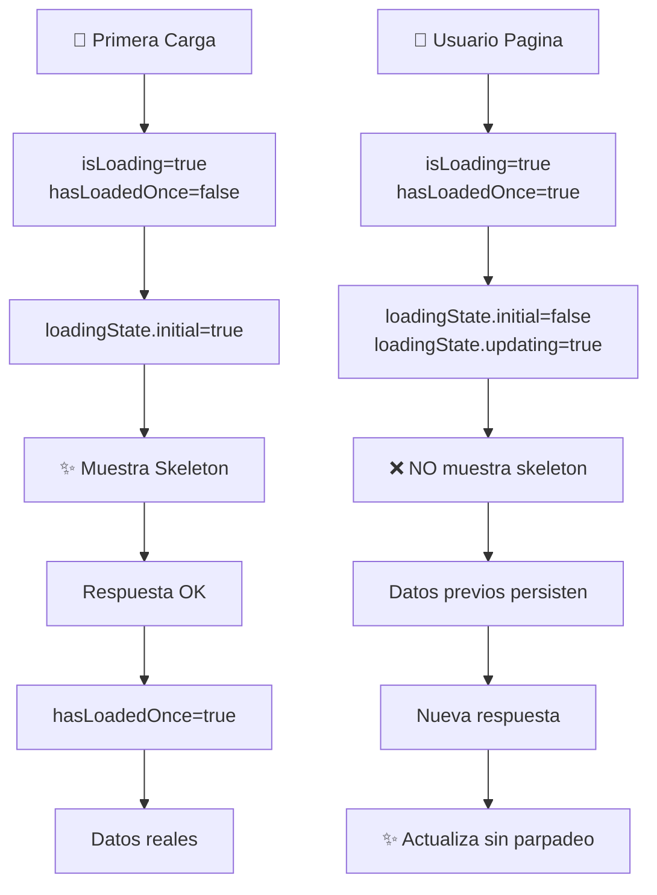

# 🎯 DataTable - Solución de Parpadeo & Optimización

## ⚡ Problema Resuelto

| Aspecto             | Antes                          | Después               |
| ------------------- | ------------------------------ | --------------------- |
| **Skeleton**        | Se mostraba en cada paginación | Solo en primera carga |
| **UX**              | Parpadeos visibles             | Transición fluida     |
| **Código**          | Redundancias                   | Limpio y documentado  |
| **Estandarización** | Sin definir                    | 10 registros/página   |

---

## 🔍 Causa & Solución

### El Problema

```ts
// ANTES: Esto causaba parpadeo en cada acción ❌
loadingState.initial = isLoading() && items().length === 0;
// → Cada paginación: isLoading=true momentáneamente, items=[],
//   muestra skeleton aunque ya teníamos datos
```

### La Solución

```ts
// DESPUÉS: Rastrea solo la PRIMERA carga ✅
private readonly hasLoadedOnce = signal(false);

loadingState.initial = isLoading() && !hasLoadedOnce()
// → Skeleton solo aparece UNA VEZ al inicio
// → Paginaciones posteriores: loading=true pero initial=false
```

---

## 🛠️ Cambios por Archivo

### BaseStore (`core/store/base.store.ts`)

- ✅ Añadido `hasLoadedOnce` signal
- ✅ Nuevo `effect()` en constructor para marcar primera carga
- ✅ Mejorada lógica de `loadingState` computed
- ✅ Removido `linkedSignal`, usado `computed()` en su lugar

### DataTableComponent (`shared/components/ui/data-table/`)

- ✅ Documentación completa en TypeScript
- ✅ Inputs organizados en secciones
- ✅ Métodos públicos documentados con JSDoc
- ✅ Template optimizado para skeleton

### CategoryListComponent (`features/catalogs/categories/`)

- ✅ Removido computed redundante `pageSize()`
- ✅ Simplificado template (menos props)
- ✅ Documentación en métodos

### Types (`shared/types/data-table.type.ts`)

- ✅ Documentación completa con ejemplos
- ✅ Estandarización de valores por defecto
- ✅ JSDoc para guiar uso

---

## 📊 Flujo de Unidades



---

## ✨ Estandarización de PageSize

### Valores Definidos

```ts
const DATATABLE_DEFAULTS = {
  pageSize: 10, // Registros por página
  pageSizeOptions: [10, 25, 50], // Opciones del dropdown
};
```

### Aplicar en Config

```ts
// ✅ CORRECTO
export const categoryTableConfig: DataTableConfig<Category> = {
  pageSize: 10,              // Optional (ya está en BaseStore)
  pageSizeOptions: [10, 25, 50],  // No cambiar
  columns: [...],
  // ...
};

// <p-table [rows]="config().pageSize ?? 10" />
```

### NO Hacer Esto ❌

```ts
// INCORRECTO: Cambiar dinámicamente causa confusión
handleChangeSize(size: number) {
  this.store.setFilter({ limit: size });  // ❌ Crea saltos de página
}
```

---

## 🚀 Próximos Pasos

Aplicar en otros módulos el mismo patrón:

```
PRIORITY: HIGH
├── src/app/features/catalogs/brands/
├── src/app/features/catalogs/products/
├── src/app/features/sales/orders/
├── src/app/features/sales/customers/
└── ... otros módulos con list/table

PATRÓN:
├── 1. Remover computed pageSize()
├── 2. Remover [rows]="pageSize()" del template
├── 3. Asegurar config.pageSize en config file
└── 4. Validar handlePagination() captura limit del evento
```

---

## ✅ Validación

| Archivo                      | Estado                     |
| ---------------------------- | -------------------------- |
| `base.store.ts`              | ✅ Compilable, sin errores |
| `data-table.component.ts`    | ✅ Compilable, sin errores |
| `category-list.component.ts` | ✅ Compilable, sin errores |
| `data-table.type.ts`         | ✅ Compilable, sin errores |

---

## 📚 Documentación Completa

Ver: **SOLUTION_DATATABLE.md** para detalles técnicos completos, ejemplos códigos y best practices.

---

## 💡 Lecciones Aprendidas

1. **Rastrear estado temporal importante** → Use signals privadas
2. **Separar initial de updating** → Mejor UX
3. **Documentar defaults** → Evita confusiones
4. **Estandarizar valores** → Consistencia
5. **Remover redundancias** → Código más limpio

---

**Status**: ✅ COMPLETADO  
**Archivos Modificados**: 6  
**Errores**: 0  
**Tests**: Validar en navegador (parpadeo desaparecería)
